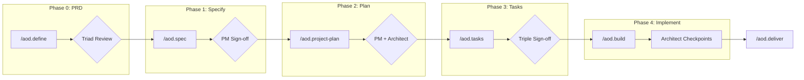

<div align="center">

# Agentic Oriented Development Kit

**A governance-first development template with SDLC Triad collaboration**

[](CHANGELOG.md)
[](https://claude.ai/claude-code)
[](LICENSE)

[Getting Started](#-quick-start) •
[Commands](#-commands) •
[How It Works](#-how-it-works) •
[Documentation](#-documentation) •
[Contributing](#-contributing)

</div>

---

## Why Agentic Oriented Development Kit?

Building software with AI agents? **Governance matters.** Agentic Oriented Development Kit ensures your AI-assisted development follows proper product management principles with clear sign-offs at every stage.

| Challenge | Solution |
|-----------|----------|
| AI agents making unauthorized decisions | **Triple sign-off** gates (PM → Architect → Team-Lead) |
| Specs drifting from product vision | **PM approval** required before any implementation |
| Technical debt from ungoverned changes | **Architect checkpoints** at every milestone |
| Unclear ownership and accountability | **SDLC Triad** with defined veto authority |

---

## ✨ Features

<table>
<tr>
<td width="50%">

### 🎯 AOD Governance
- PM-driven product vision and alignment
- Dual sign-off (PM + Architect) before implementation
- Feature specs linked to PRDs and OKRs

</td>
<td width="50%">

### 🔺 SDLC Triad Framework
- **PM**: Defines What & Why
- **Architect**: Defines How
- **Team-Lead**: Defines When & Who

</td>
</tr>
<tr>
<td width="50%">

### ⚡ Parallel Reviews (v2.0)
- Context forking for simultaneous reviews
- Triple sign-off executes in parallel
- Automatic result merging by severity

</td>
<td width="50%">

### 🛠️ Modular Rules System
- Concise CLAUDE.md (~80 lines)
- Topic-specific rule files in `.claude/rules/`
- Zero merge conflicts

</td>
</tr>
</table>

---

## 🚀 Quick Start

### Installation

```bash
# Clone the template
git clone https://github.com/davidmatousek/agentic-oriented-development-kit.git my-project
cd my-project

# Run interactive setup
make init
```

The init script will prompt for your project details and configure everything automatically.

<details>
<summary><b>📋 Manual Setup</b></summary>

If you prefer manual configuration:

```bash
# Clone repository
git clone https://github.com/davidmatousek/agentic-oriented-development-kit.git my-project
cd my-project

# Edit constitution with your project details
# Replace all {{PLACEHOLDER}} variables in:
vim .aod/memory/constitution.md
```

**Required variables:**
| Variable | Example |
|----------|---------|
| `{{PROJECT_NAME}}` | my-saas-platform |
| `{{PROJECT_DESCRIPTION}}` | AI-powered analytics dashboard |
| `{{TECH_STACK_DATABASE}}` | PostgreSQL |
| `{{TECH_STACK_VECTOR}}` | pgvector |
| `{{TECH_STACK_AUTH}}` | JWT |
| `{{RATIFICATION_DATE}}` | 2026-01-31 |

</details>

### Verify Installation

```bash
make check
```

### Your First Feature

```bash
# 1. Create your first PRD (includes optional vision workshop)
/aod.define user-authentication

# 2. Follow the AOD Kit workflow
/aod.spec    # Define requirements → PM sign-off
/aod.project-plan       # Technical design → PM + Architect sign-off
/aod.tasks      # Task breakdown → Triple sign-off
/aod.build  # Execute with checkpoints
```

---

## 📖 Commands

### Triad Commands (Recommended)

Full governance with automatic sign-offs at each stage.

| Command | Description | Sign-offs |
|---------|-------------|-----------|
| `/aod.define <topic>` | Create PRD (includes optional vision workshop) | Triad review |
| `/aod.spec` | Create spec.md | PM |
| `/aod.project-plan` | Create plan.md | PM + Architect |
| `/aod.tasks` | Create tasks.md | PM + Architect + Team-Lead |
| `/aod.build` | Execute with checkpoints | Architect gates |
| `/aod.deliver` | Close with doc updates | — |

---

## 🔄 How It Works



### Sign-off Requirements

| Artifact | Required Approvals | Purpose |
|----------|-------------------|---------|
| `spec.md` | PM | Product alignment |
| `plan.md` | PM + Architect | Technical soundness |
| `tasks.md` | PM + Architect + Team-Lead | Execution readiness |

### Veto Authority

| Scenario | Who Can Veto | Grounds |
|----------|-------------|---------|
| PRD infrastructure claims | Architect | Contradicts baseline |
| PRD technical approach | Architect | Technically infeasible |
| PRD timeline estimate | Team-Lead | Ignores capacity |
| spec.md alignment | PM | Misaligned with vision |
| plan.md architecture | Architect | Violates principles |
| tasks.md timeline | Team-Lead | Unrealistic breakdown |

---

## 📁 Project Structure

```
agentic-oriented-development-kit/
├── .claude/
│   ├── agents/           # 13 specialized agents
│   ├── skills/           # Automation capabilities
│   ├── commands/         # Triad commands
│   └── rules/            # Modular governance rules
│       ├── governance.md
│       ├── git-workflow.md
│       ├── deployment.md
│       └── ...
├── .aod/
│   ├── spec.md           # Feature specification
│   ├── plan.md           # Technical design
│   ├── tasks.md          # Task breakdown
│   └── memory/
│       └── constitution.md  # ← CUSTOMIZE THIS
├── docs/
│   ├── product/          # Vision, PRDs, roadmaps
│   ├── architecture/     # System design, ADRs
│   ├── devops/           # Deployment guides
│   └── core_principles/  # Methodologies
├── specs/                # Per-feature specifications
├── CLAUDE.md             # AI agent context
└── CHANGELOG.md          # Version history
```

---

## 🏛️ Core Principles

<details>
<summary><b>View all 11 governance principles</b></summary>

1. **General-Purpose Architecture** — Domain-agnostic, works with any workflow
2. **API-First Design** — API contracts before UI/MCP implementation
3. **Backward Compatibility** — 100% local `.aod/` file support
4. **Concurrency & Data Integrity** — ACID guarantees, task locking
5. **Privacy & Data Isolation** — Per-user/org isolation, encryption at rest
6. **Testing Excellence** — Mandatory test coverage (80% minimum)
7. **Definition of Done** — 3-step validation (Deployed, Tested, User Validated)
8. **Observability & Root Cause Analysis** — Five Whys methodology
9. **Git Workflow** — Feature branches only, never commit to main
10. **Product-AOD Alignment** — PM + Architect dual sign-off
11. **SDLC Triad Collaboration** — PM + Architect + Tech-Lead workflow

> **Note:** These principles are universal. Customize only the System Architecture Constraints section in the constitution.

</details>

---

## 📚 Documentation

| Document | Purpose |
|----------|---------|
| [Constitution](.aod/memory/constitution.md) | Governance principles (customize this) |
| [CHANGELOG](CHANGELOG.md) | Version history |
| [MIGRATION](MIGRATION.md) | Upgrade guide |
| [Triad Workflow](docs/AOD_TRIAD.md) | Collaboration guide |

---

## 🤝 Contributing

```bash
# Fork and clone
git clone https://github.com/YOUR_USERNAME/agentic-oriented-development-kit.git
cd agentic-oriented-development-kit

# Create feature branch
git checkout -b feature/your-improvement

# Make changes and submit PR
```

See [CONTRIBUTING.md](CONTRIBUTING.md) for guidelines.

---

## 📄 License

This project is licensed under the MIT License — see [LICENSE](LICENSE) for details.

---

## 💬 Support

- **Issues**: [GitHub Issues](https://github.com/davidmatousek/agentic-oriented-development-kit/issues)
- **Discussions**: [GitHub Discussions](https://github.com/davidmatousek/agentic-oriented-development-kit/discussions)
- **Public Template**: [agentic-oriented-development-kit](https://github.com/davidmatousek/agentic-oriented-development-kit)

---

<div align="center">

**[⬆ Back to Top](#agentic-oriented-development-kit)**

Made with the SDLC Triad: PM + Architect + Team-Lead

</div>
