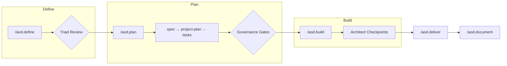

<div align="center">

# {{PROJECT_NAME}}

**A governance-first development template with SDLC Triad collaboration**

[](CHANGELOG.md)
[](https://claude.ai/claude-code)
[](LICENSE)

[Getting Started](#-quick-start) •
[Commands](#-commands) •
[How It Works](#-how-it-works) •
[Documentation](#-documentation) •
[Contributing](#-contributing)

</div>

---

## Why {{PROJECT_NAME}}?

Building software with AI agents? **Governance matters.** {{PROJECT_NAME}} ensures your AI-assisted development follows proper product management principles with clear sign-offs at every stage.

| Challenge | Solution |
|-----------|----------|
| AI agents making unauthorized decisions | **Triple sign-off** gates (PM → Architect → Team-Lead) |
| Specs drifting from product vision | **PM approval** required before any implementation |
| Technical debt from ungoverned changes | **Architect checkpoints** at every milestone |
| Unclear ownership and accountability | **SDLC Triad** with defined veto authority |

---

## ✨ Features

<table>
<tr>
<td width="50%">

### 🎯 AOD Governance
- PM-driven product vision and alignment
- Dual sign-off (PM + Architect) before implementation
- Feature specs linked to PRDs and OKRs

</td>
<td width="50%">

### 🔺 SDLC Triad Framework
- **PM**: Defines What & Why
- **Architect**: Defines How
- **Team-Lead**: Defines When & Who

</td>
</tr>
<tr>
<td width="50%">

### ⚡ Parallel Reviews (v2.0)
- Context forking for simultaneous reviews
- Triple sign-off executes in parallel
- Automatic result merging by severity

</td>
<td width="50%">

### 🛠️ Modular Rules System
- Concise CLAUDE.md (~80 lines)
- Topic-specific rule files in `.claude/rules/`
- Zero merge conflicts

</td>
</tr>
<tr>
<td width="50%">

### 📦 Stack Packs
- Pre-configured convention contracts for your technology stack
- Persona supplements turn every agent into a stack specialist
- Project scaffolding from `git clone` to running code
- Security patterns enforced by default (OWASP-mapped)
- Use `/aod.stack use nextjs-supabase` to activate

</td>
<td width="50%">

### 🎨 Design System
- `/aod.foundation` workshop for brand identity setup
- 6 design archetypes (boldness, playful, precision, etc.)
- Semantic CSS tokens generated from archetypes
- Design quality gate in build pipeline
- Brand-aware UI code generation

</td>
</tr>
</table>

---

## 🚀 Quick Start

### Installation

Navigate to your projects directory (e.g., `~/Projects/` or `~/code/`) — the clone command will create a new subfolder here:

```bash
# Clone the template
git clone https://github.com/davidmatousek/agentic-oriented-development-kit.git my-project
cd my-project

# Run interactive setup
make init
```

> **Note**: `PROJECT_NAME` and `PROJECT_DESCRIPTION` values must not contain `/`, `&`, or `\`. These characters conflict with the `sed` substitution delimiter and will cause initialization to fail or produce corrupted files. Use safe alternatives (e.g., "My Project" instead of "My/Project").

The init script will prompt for your project details and configure everything automatically.

<details>
<summary><b>📋 Manual Setup</b></summary>

If you prefer manual configuration:

```bash
# From your projects directory (e.g., ~/Projects/)
git clone https://github.com/davidmatousek/agentic-oriented-development-kit.git my-project
cd my-project

# Edit constitution with your project details
# Replace all {{PLACEHOLDER}} variables in:
vim .aod/memory/constitution.md
```

**Required variables:**
| Variable | Example |
|----------|---------|
| `{{PROJECT_NAME}}` | my-saas-platform |
| `{{PROJECT_DESCRIPTION}}` | AI-powered analytics dashboard |
| `{{TECH_STACK_DATABASE}}` | PostgreSQL |
| `{{RATIFICATION_DATE}}` | 2026-01-31 |

> **Tip**: If using a stack pack, its `defaults.env` provides all technology defaults. Only manual setup requires editing these variables.

</details>

### Verify Installation

```bash
make check
```

### Your First Feature

Open Claude Code (CLI or VS Code extension) in your project directory:

```bash
# CLI
claude

# Or open the project folder in VS Code and use the Claude Code extension
```

If you activated a stack pack, install dependencies first:

```bash
npm install
```

> **Note:** If `npm` is not found, you may need to install Node.js (`brew install node` on macOS) or ensure your shell PATH includes it (e.g., `export PATH="/opt/homebrew/bin:$PATH"` for Homebrew).

Then establish your product identity and start building:

```
# 1. Guided workshop — product vision + design identity (recommended)
/aod.foundation

# 2. Create your first PRD
/aod.define user-authentication

# 3. Plan — chains spec → project-plan → tasks with governance gates
/aod.plan

# 4. Build — execute with architect checkpoints
/aod.build
```

---

## 🔄 Staying Current

Keep your adopter project in sync with upstream PLSK template improvements.

```bash
make update --dry-run    # Preview pending upstream changes (no writes)
make update              # Interactive apply with confirmation prompt
make update --yes        # Non-interactive apply (for automation)
```

`/aod.update` (direction: `PLSK → user`) pulls the latest upstream template changes into your project. It protects user-owned files (product docs, architecture, brands, specs, constitution) via a hardcoded guard list — even a malicious upstream manifest cannot overwrite them. Personalized files (e.g., `.claude/rules/scope.md`) are re-substituted with your `.aod/personalization.env` values, so placeholders never leak.

**When to run**: after a new PLSK release, or periodically (monthly is typical). Full guide with flags, exit codes, and FAQ in [`docs/guides/DOWNSTREAM_UPDATE.md`](docs/guides/DOWNSTREAM_UPDATE.md).

**Opposite direction**: `/aod.sync-upstream` (`user → PLSK`) pushes your local template improvements back to the public PLSK repo — for maintainers contributing to the template itself.

---

## 📖 Commands

### Triad Commands (Recommended)

Full governance with automatic sign-offs at each stage.

| Command | Description | Sign-offs |
|---------|-------------|-----------|
| `/aod.foundation` | Guided workshop — product vision + design identity | — |
| `/aod.define <topic>` | Create PRD with Triad validation | Triad review |
| `/aod.plan` | Plan stage: chains spec → project-plan → tasks | PM → PM+Architect → Triple |
| `/aod.build` | Execute with checkpoints + design quality gate | Architect gates |
| `/aod.deliver` | Close with doc updates | — |
| `/aod.document` | Code quality review (simplify, docstrings, CHANGELOG) | — |
| `/aod.clarify` | Resolve spec ambiguities | — |
| `/aod.analyze` | Cross-artifact consistency check | — |
| `/aod.run` | Full lifecycle orchestrator (stages 1-5) | All governance gates |
| `/aod.stack` | Manage stack packs (`use`, `remove`, `list`, `scaffold`) | — |

> **Full command reference**: See [`.claude/rules/commands.md`](.claude/rules/commands.md) for all commands including utility, orchestration, and stack pack commands.

---

## 🔄 How It Works


```mermaid
flowchart LR
    subgraph "Define"
        A["/aod.define"] --> B{Triad Review}
    end

    subgraph "Plan"
        B --> C["/aod.plan"]
        C --> D["spec → project-plan → tasks"]
        D --> E{Governance Gates}
    end

    subgraph "Build"
        E --> F["/aod.build"]
        F --> G[Architect Checkpoints]
    end

    G --> H["/aod.deliver"]
    H --> I["/aod.document"]
```

### Sign-off Requirements

| Artifact | Required Approvals | Purpose |
|----------|-------------------|---------|
| `spec.md` | PM | Product alignment |
| `plan.md` | PM + Architect | Technical soundness |
| `tasks.md` | PM + Architect + Team-Lead | Execution readiness |

### Veto Authority

| Scenario | Who Can Veto | Grounds |
|----------|-------------|---------|
| PRD infrastructure claims | Architect | Contradicts baseline |
| PRD technical approach | Architect | Technically infeasible |
| PRD timeline estimate | Team-Lead | Ignores capacity |
| spec.md alignment | PM | Misaligned with vision |
| plan.md architecture | Architect | Violates principles |
| tasks.md timeline | Team-Lead | Unrealistic breakdown |

---

## 📁 Project Structure

```
{{PROJECT_NAME}}/
├── .claude/
│   ├── agents/           # 13 specialized agents
│   ├── skills/           # Automation capabilities
│   ├── commands/         # Triad commands
│   ├── design/           # Design archetypes (6 visual personalities)
│   └── rules/            # Modular governance rules
│       ├── governance.md
│       ├── design-quality.md
│       ├── git-workflow.md
│       ├── deployment.md
│       └── ...
├── .aod/                    # Active feature workspace
│   ├── spec.md           # Feature specification
│   ├── plan.md           # Technical design
│   ├── tasks.md          # Task breakdown
│   └── memory/
│       └── constitution.md  # ← CUSTOMIZE THIS
├── docs/
│   ├── product/          # Vision, PRDs, roadmaps
│   ├── architecture/     # System design, ADRs
│   ├── devops/           # Deployment guides
│   └── core_principles/  # Methodologies
├── specs/                # Archived feature artifacts (spec, plan, tasks per feature)
├── brands/               # Brand identity assets (vision + design tokens)
│   └── _example/         # Template for brand setup
├── stacks/               # Stack packs (conventions, personas, scaffold)
│   ├── nextjs-supabase/  # Full pack: Next.js + Supabase + Prisma
│   ├── fastapi-react/    # Full pack: FastAPI + React + Supabase
│   ├── fastapi-react-local/ # Full pack: FastAPI + React (local SQLite)
│   ├── knowledge-system/ # Domain pack: Knowledge/curriculum management
│   └── swiftui-cloudkit/ # Skeleton pack: SwiftUI + CloudKit
├── CLAUDE.md             # AI agent context
└── CHANGELOG.md          # Version history
```

---

## 🏛️ Core Principles

<details>
<summary><b>View all 11 governance principles</b></summary>

1. **General-Purpose Architecture** — Domain-agnostic, works with any workflow
2. **API-First Design** — API contracts before UI/MCP implementation
3. **Backward Compatibility** — 100% local `.aod/` file support
4. **Concurrency & Data Integrity** — ACID guarantees, task locking
5. **Privacy & Data Isolation** — Per-user/org isolation, encryption at rest
6. **Testing Excellence** — Mandatory test coverage (80% minimum)
7. **Definition of Done** — 3-step validation (Deployed, Tested, User Validated)
8. **Observability & Root Cause Analysis** — Five Whys methodology
9. **Git Workflow** — Feature branches only, never commit to main
10. **Product-AOD Alignment** — PM + Architect dual sign-off
11. **SDLC Triad Collaboration** — PM + Architect + Tech-Lead workflow

> **Note:** These principles are universal. Customize only the System Architecture Constraints section in the constitution.

</details>

---

## 📚 Documentation

| Document | Purpose |
|----------|---------|
| [Constitution](.aod/memory/constitution.md) | Governance principles (customize this) |
| [CHANGELOG](CHANGELOG.md) | Version history |
| [MIGRATION](MIGRATION.md) | Upgrade guide |
| [Triad Workflow](docs/AOD_TRIAD.md) | Collaboration guide |

---

## 🌐 Public Template

The public version of this template is available at **[agentic-oriented-development-kit](https://github.com/davidmatousek/agentic-oriented-development-kit)** — a clean, genericized extraction suitable for any project.

To sync changes from this private repo to the public template, run:

```bash
scripts/extract.sh --sync
```

---

## 🤝 Contributing

### To This Template

```bash
# Fork and clone
git clone https://github.com/YOUR_USERNAME/agentic-oriented-development-kit.git
cd agentic-oriented-development-kit

# Create feature branch
git checkout -b feature/your-improvement

# Make changes and submit PR
```

### To the Public Template

Improvements benefiting all users should go to [agentic-oriented-development-kit](https://github.com/davidmatousek/agentic-oriented-development-kit).

---

## 📄 License

This project is licensed under the MIT License — see [LICENSE](LICENSE) for details.

---

## 💬 Support

- **Issues**: [GitHub Issues](https://github.com/davidmatousek/agentic-oriented-development-kit/issues)
- **Discussions**: [GitHub Discussions](https://github.com/davidmatousek/agentic-oriented-development-kit/discussions)
- **Template Repository**: [agentic-oriented-development-kit](https://github.com/davidmatousek/agentic-oriented-development-kit)

---

<div align="center">

**[⬆ Back to Top](#agentic-oriented-development-kit)**

Made with the SDLC Triad: PM + Architect + Team-Lead

</div>
