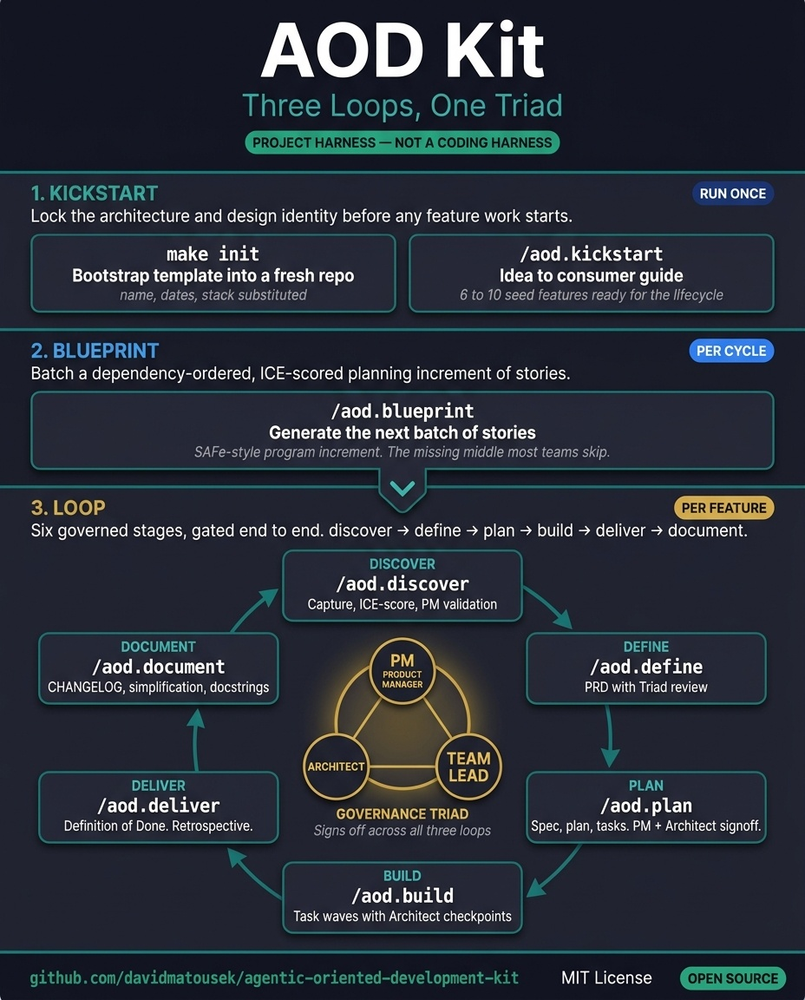

<!--
  Aesthetic Philosophy (Issue 176, Three Loops repositioning):
  - Visual mood: professional, technical, opinionated. Matches AOD Kit's project-harness positioning.
  - Typeface: GitHub-rendered markdown (no custom fonts on landing page). Badges use shields.io defaults.
  - Color temperature: cool and neutral. Governance and methodology, not playful or warm-corporate.
  - Visual density: medium-balanced. Enough detail to convey depth, no wall-of-text.
-->

<div align="center">

# AOD Kit

**AOD Kit isn't just a coding harness. It's also a full project harness. Three loops, one Triad, governed at every gate.**

[](CHANGELOG.md)
[](https://claude.ai/claude-code)
[](LICENSE)

[Three Loops](#three-loops-one-triad) •
[Quick Start](#quick-start) •
[Capabilities](#capabilities) •
[Documentation](#documentation) •
[Contributing](#contributing)

</div>

---

## Three Loops, One Triad



AOD Kit runs at three frequencies. Coding harnesses only address the smallest. Project harnesses address all three, with the same Triad (PM, Architect, Team-Lead) signing off at every gate.

### 1. Kickstart (run once)

Lock the architecture and design identity before any feature work starts.

- `make init` bootstraps the template into a fresh repo, substituting project name, dates, and stack.
- `/aod.kickstart` turns an idea into a consumer guide with 6 to 10 seed features ready for the lifecycle.

### 2. Blueprint (per cycle)

Batch a dependency-ordered, ICE-scored planning increment of stories. SAFe calls this a program increment. AOD Kit calls it a blueprint. Either way, it's the missing middle most teams skip.

- `/aod.blueprint` generates the next batch of stories from the consumer guide and pushes them to GitHub Issues.

### 3. Sprint (per feature)

Six governed stages. PM, Architect, and Team-Lead sign off at every gate.

- `/aod.discover` captures the idea and ICE-scores it.
- `/aod.define` drafts a PRD with Triad review.
- `/aod.plan` generates spec, plan, and tasks with PM and Architect sign-off.
- `/aod.build` executes task waves with Architect checkpoints.
- `/aod.deliver` validates Definition of Done and runs the retrospective.
- `/aod.document` simplifies code, updates CHANGELOG, and writes API docs.

*Coding harnesses run one loop. AOD Kit runs three.*

---

## Quick Start

```bash
# Clone the template
git clone https://github.com/davidmatousek/agentic-oriented-development-kit.git my-project
cd my-project

# Bootstrap your project (one-shot, substitutes project name, stack, dates)
make init

# Set up product vision and design identity (recommended)
/aod.foundation
```

After `make init`, the README, CLAUDE.md, and other templated files are personalized to your project. From there, run `/aod.define` to draft your first PRD with Triad governance.

Requires [Claude Code](https://claude.ai/claude-code) v2.1.16+ and `git`. Other AI agent tools work too (the methodology is agent-agnostic), but built-in slash commands are tuned for Claude Code.

---

## Capabilities

| Capability | What it does |
|---|---|
| **Three Loops, One Triad** | Kickstart (run once), Blueprint (per cycle), and Sprint (per feature). Each loop has its own commands and gates. The Triad signs off across all three. |
| **SDLC Triad governance** | PM, Architect, and Team-Lead sign-offs at every phase gate (spec, plan, tasks). Triple sign-off is the minimum governance floor. |
| **Six-stage Sprint loop** | Discover → Define → Plan → Build → Deliver → Document. The per-feature loop. Each stage has its own commands, skills, and quality gates. |
| **Product Discovery Lifecycle (PDL)** | Structured idea capture, ICE scoring, PM validation, and user story generation. Raw idea to backlog-ready in one flow. |
| **Stack Packs** | Drop-in technology conventions for Next.js + Supabase, FastAPI + React, and more. Activate one with `/aod.stack use <pack>`. |
| **Modular rules system** | `.claude/rules/` contains commit-friendly governance, design-quality, deployment, and context-loading rules. Easy to customize per project. |
| **Local-first workflows** | All artifacts live in `.aod/` and `specs/` as markdown files in your repo. Cloud-optional. |
| **Three governance tiers** | Light (solo or prototypes), Standard (team projects, default), Full (regulated industries). Choose what fits your project. |

---

## Documentation

- **[The AOD Triad](docs/AOD_TRIAD.md)** explains how PM, Architect, and Team-Lead collaborate at every gate.
- **[Standards](docs/standards/README.md)** covers Definition of Done, naming conventions, and git workflow.
- **[Core Principles](docs/core_principles/README.md)** lists thinking lenses (5 Whys, Pre-Mortem, First Principles, and more) for systematic analysis.
- **[Adopter Guides](docs/guides/README.md)** walks through downstream updates, Triad collaboration, and the kickstarter flow for new projects.
- **[Architecture](docs/architecture/README.md)** documents system design, ADRs, and deployment environments.
- **[Product Documentation](docs/product/README.md)** holds vision, PRDs, roadmap, OKRs, and user stories.
- **[Constitution](.aod/memory/constitution.md)** defines core governance principles (XI universal rules) and tier configuration.

---

## Project Structure

```
your-project/
├── .aod/              # Active feature workspace + scripts + templates
│   ├── memory/        # Constitution and project memory
│   ├── scripts/bash/  # Lifecycle automation (state, GitHub sync, etc.)
│   ├── scaffold/      # Bootstrap-only artifacts (token-bearing seeds)
│   └── templates/     # spec.md / plan.md / tasks.md templates
├── .claude/           # Agents, skills, commands, design archetypes
│   ├── agents/        # Triad + specialized agent personas
│   ├── skills/        # Reusable automation capabilities
│   ├── commands/      # Slash commands (/aod.define, /aod.plan, etc.)
│   └── rules/         # Modular governance rules
├── docs/              # Product, architecture, devops, standards docs
│   └── branding/      # Loop poster and other brand assets
├── specs/             # Per-feature artifacts (spec.md, plan.md, tasks.md, research.md)
├── stacks/            # Optional stack packs (Next.js+Supabase, FastAPI+React, etc.)
├── scripts/           # init.sh, check.sh, extract.sh, sync-upstream.sh
└── CLAUDE.md          # AI agent context (auto-loaded by Claude Code)
```

You bring your own `src/` (or `backend/`, `frontend/`, etc.). AOD lives alongside your code, not inside it.

---

## Contributing

AOD is open source under the [MIT License](LICENSE). Contributions, bug reports, and feature ideas are welcome.

- File issues at [github.com/davidmatousek/agentic-oriented-development-kit/issues](https://github.com/davidmatousek/agentic-oriented-development-kit/issues).
- Start discussions at [github.com/davidmatousek/agentic-oriented-development-kit/discussions](https://github.com/davidmatousek/agentic-oriented-development-kit/discussions).
- Read the [Contributing guide](CONTRIBUTING.md) before opening a PR.

---

<div align="center">

Built with the AOD Triad. PM ✓ · Architect ✓ · Team-Lead ✓

[Open an issue](https://github.com/davidmatousek/agentic-oriented-development-kit/issues) · [Read the Triad guide](docs/AOD_TRIAD.md) · [Run `make init`](#quick-start)

</div>
