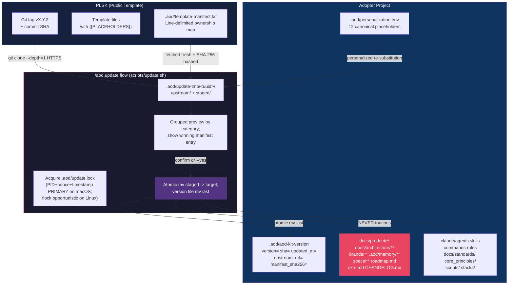

# Downstream Update Architecture

**Owner**: Architect
**Last Updated**: 2026-04-19
**Feature**: 129 — Downstream Template Update Mechanism with File-Ownership Manifest

---

## Overview

Adopters of the AOD methodology pull upstream template improvements via `/aod.update` (or `make update`). This flow is the **downstream counterpart** to `/aod.sync-upstream` (which pushes local template improvements back to the public PLSK repo). The two commands share a common library surface but have distinct execution flows.

**Direction arrows** (used consistently in all adopter docs):
- `user → PLSK` = `/aod.sync-upstream` (contribute back)
- `PLSK → user` = `/aod.update` (pull updates)

---

## System Diagram



---

## Pull Flow: PLSK → Adopter

Triggered by `make update` or `/aod.update`. Nine sub-phases matching the FR-005 atomicity sequence:

```mermaid
sequenceDiagram
    participant Adopter as Adopter Project
    participant Script as scripts/update.sh
    participant Libs as .aod/scripts/bash/template-*.sh
    participant Upstream as PLSK (HTTPS)

    Adopter->>Script: make update
    Script->>Script: 1. Preflight (parse args, acquire lock)
    Script->>Libs: template-git.sh aod_template_fs_device
    Libs-->>Script: Same-filesystem check (stat -f %d / -c %d)
    Script->>Upstream: 2. Fetch (git clone --depth=1 into temp)
    Upstream-->>Script: .aod/update-tmp/<uuid>/upstream/
    Script->>Libs: 3. Load manifest + SHA-256 hash
    Libs-->>Script: Flag user→owned transitions
    Script->>Libs: 4. Plan operations (precedence resolution)
    Libs-->>Script: List: (path, category, winning_entry, action)
    Script->>Libs: 5. Validate (guard list, symlinks, path traversal)
    Libs-->>Script: Pass/halt
    Script->>Libs: 6. Stage (substitute placeholders for personalized)
    Libs-->>Script: .aod/update-tmp/<uuid>/staged/
    Script->>Adopter: 7. Preview (grouped by category)
    Adopter->>Script: Confirm (or --yes)
    Script->>Adopter: 8. Apply (atomic mv per file; version file last)
    Script->>Script: 9. Cleanup (remove staging on success; preserve on failure)
    Script-->>Adopter: Exit 0 / 1-8 on failure
```

---

## Manifest Model

### Format

**Line-delimited plain text** — NOT YAML. Rationale: bash 3.2 compatibility (no associative arrays, no `yq` dependency).

```
# .aod/template-manifest.txt
# Precedence (highest wins): ignore > (hardcoded user-owned guard list)
#                          > user > scaffold > merge > personalized > owned
# Policy: no-code-from-upstream — user-owned paths never receive content.

owned|.claude/agents/**
owned|.claude/skills/**
personalized|.claude/rules/scope.md
personalized|CLAUDE.md
user|docs/product/**
user|.aod/memory/**
scaffold|docs/devops/01_Local/**
ignore|tests/**
```

### Categories

| Category | Semantics | P0 Runtime Behavior |
|---|---|---|
| `owned` | Overwritten on update (upstream verbatim) | Full overwrite |
| `personalized` | Overwritten with placeholders re-applied | Overwrite + re-substitute |
| `user` | Never touched, hidden from preview | Skip silently |
| `scaffold` | Listed for CI coverage only (P0); copy-if-missing deferred to P1/129b | Skip (listed in coverage only) |
| `merge` | Previewed with warning; 3-way merge deferred to P1/129b | Warn-and-skip |
| `ignore` | Excluded from coverage check; not touched | Skip silently |

### Precedence

Explicit (not last-match-wins). Resolved by `template-manifest.sh::resolve_category`:

```
ignore > (hardcoded user-owned guard list, FR-007) > user > scaffold > merge > personalized > owned
```

The preview MUST show which entry won for each file. Documented in the manifest header comment AND surfaced in CLI output.

### Parser Implementation

Bash 3.2 compatible `while read` + `case`:

```bash
# .aod/scripts/bash/template-manifest.sh
aod_template_parse_manifest() {
    local manifest_path="$1"
    while IFS='|' read -r category glob_or_path; do
        case "$category" in
            '#'*|'') continue ;;    # skip comments + blanks
            owned|personalized|user|scaffold|merge|ignore)
                echo "${category}|${glob_or_path}"
                ;;
            *)
                echo "ERROR: unknown category '$category'" >&2
                return 1
                ;;
        esac
    done < "$manifest_path"
}
```

---

## Atomicity Contract

Applies [ADR-001 (atomic state persistence)](../02_ADRs/ADR-001-atomic-state-persistence.md) at a transaction-level granularity:

1. **Fetch** upstream → `.aod/update-tmp/<uuid>/upstream/` (via `git clone --depth=1`)
2. **Pre-flight same-filesystem check** via device-number comparison:
   - `stat -f %d` on macOS (BSD)
   - `stat -c %d` on Linux (GNU)
   - **NOT `%T`** (returns filesystem type name, false-passes two distinct APFS volumes or NFS mounts)
3. **Stage** processed files (with `personalized` re-substitution) → `.aod/update-tmp/<uuid>/staged/`
4. **Apply**: `mv` each staged file atomically into target path
5. **Commit**: `mv` `.aod/aod-kit-version.tmp` → `.aod/aod-kit-version` LAST (the transaction's commit point)
6. **Cleanup** on success OR **preserve** staging on failure (for inspection)

**Lock file** (`.aod/update.lock`, KV format): `pid`, `nonce`, `started_at`, `cmdline`.

### Concurrency Model — PID+nonce PRIMARY on macOS

`flock(1)` is Linux-native. **macOS does NOT ship it by default** (`which flock` returns nothing on macOS 25.3.0). Since macOS is the primary adopter dev target, the **PID + random nonce + timestamp scheme is the PRIMARY path**, not a fallback. `flock` is used opportunistically as a fast-path when available.

**Race-window mitigations** (documented in spec data-model.md §Entity 5):
| Window | Mitigation |
|---|---|
| TOCTOU between `kill -0` read and force-acquire write | Nonce re-verification after force-acquire |
| PID reuse (kernel recycles PID to unrelated process) | ">1 hour staleness" + nonce re-verify |
| Long-running legitimate update (`started_at` > 1 hour) | `scripts/update.sh` heartbeat: updates `started_at` every 5 min during long fetches |

---

## Defense-in-Depth — Hardcoded Guard List (FR-007)

A readonly array embedded directly in `scripts/update.sh` (NOT in a shared library — tamper resistance). Overrides the manifest even if upstream maliciously re-categorizes:

```bash
readonly USER_OWNED_GUARD=(
  'docs/product/**'
  'docs/architecture/**'
  'brands/**'
  '.aod/memory/**'
  'specs/**'
  'roadmap.md'
  'okrs.md'
  'CHANGELOG.md'
)
```

**Glob semantics**: patterns are **exact-path matches anchored to repo root**. `roadmap.md` matches ONLY `roadmap.md` at repo root (NOT `docs/roadmap.md` or `project-a/roadmap.md`). Monorepo-style `project/roadmap.md` is out of scope for P0.

Glob match uses `case` statement (bash 3.2 compatible) — no `globstar`.

**Two-layer check**:
1. At plan-operations phase (before staging)
2. In `template-validate.sh::assert_safe_path` (before apply)

---

## Supply-Chain Defenses

Feature 129 establishes three independent supply-chain defenses:

| Defense | Mechanism | File |
|---|---|---|
| **Commit SHA pinning** | Every install/update records the exact upstream commit SHA | `.aod/aod-kit-version` `sha=` field |
| **Retag detection** | If a tag now points to a different SHA than recorded, halt unless `--force-retag` | Computed in `template-git.sh::detect_retag` |
| **Manifest hash tracking** | SHA-256 of the manifest fetched on every install/update; flag transitions | `.aod/aod-kit-version` `manifest_sha256=` field; `user → owned` transitions flagged in preview |

---

## CI Enforcement — `.github/workflows/manifest-coverage.yml`

PLSK's **first** CI workflow. Catches forgotten manifest categorization before merge.

**Design choices** (retag-defense philosophy applied):
- `actions/checkout` pinned to a specific SHA (not `@v4`) — documented with comment
- Explicit `permissions: contents: read` (least privilege)
- `concurrency: group: manifest-coverage-${{ github.ref }}, cancel-in-progress: true`
- `scripts/check-manifest-coverage.sh` runs in a **`bash:3.2` Docker container** to catch bash-4+ regressions in the validator itself (GitHub's `ubuntu-latest` ships bash 5.x)

**Pre-commit hook variant**: `scripts/check-manifest-coverage.sh` runs via `.git/hooks/pre-commit` on staged files (opt-in; documented in CONTRIBUTING.md).

---

## Shared Library Surface — `.aod/scripts/bash/template-*.sh`

Five bash 3.2 function libraries (all **sourced**, not executed — [Function Library Sourcing pattern](../03_patterns/README.md#pattern-function-library-sourcing)):

| Library | Responsibility |
|---|---|
| `template-manifest.sh` | Line-delimited parser + category lookup + glob match + precedence resolution |
| `template-validate.sh` | Path sanitization (`..`, `~`, absolute reject), symlink rejection, residual placeholder scan |
| `template-json.sh` | JSON output helpers, `schema_version: 1.0` |
| `template-git.sh` | HTTPS upstream fetch (standalone `git clone --depth=1`), diff computation, retag detection, fs-device helper |
| `template-substitute.sh` | 12-placeholder canonical list (single source of truth), bash `${str//pattern/replacement}` literal-replace, env file load |

**Key architectural decision**: Placeholder substitution uses bash `${str//pattern/replacement}` parameter expansion (truly literal, bash 3.2 compatible) — NOT `sed`. Rationale: `sed` interprets `&` and `\1` in the RHS even with non-default delimiters, which would break `PROJECT_NAME="Cats & Dogs"`. Bash parameter expansion has no regex interpretation on the replacement side.

**Factor-out boundary with `sync-upstream.sh`**: narrower than initially scoped. Only `template-json.sh` is a clean factor-out; `template-validate.sh` is mixed (leak-scan factored; other assertions new); `template-manifest.sh` and `template-git.sh` are new code (sync-upstream uses different categorization model and git-remote-merge flow rather than fetch-to-temp).

---

## Key Design Decisions

- **Line-delimited manifest over YAML**: bash 3.2 compatibility; avoids `yq` dependency.
- **Explicit category precedence (not last-match-wins)**: surfaces in preview output, documented in manifest header, safer default.
- **Same-filesystem pre-flight for staging**: atomicity is conditional on POSIX `rename(2)` within one filesystem — verified via device number (`stat -f %d` / `-c %d`), not filesystem type name.
- **Tag + SHA dual storage**: supply-chain defense against adversarial retagging.
- **PID+nonce PRIMARY on macOS + flock opportunistic on Linux**: `flock(1)` isn't shipped on macOS; PID+nonce is the mandatory path, not a fallback.
- **Post-write residual placeholder validator**: defense against upstream-introduced unknown placeholders.
- **Fetch fresh manifest each run + hash tracking**: reduces drift, surfaces adversarial re-categorization.
- **Hardcoded guard list embedded in script (not library)**: tamper resistance — overrides manifest regardless of upstream contents.

---

## Related

- [Upstream Sync Architecture](upstream-sync-architecture.md) — opposite-direction flow
- [ADR-001 Atomic State Persistence](../02_ADRs/ADR-001-atomic-state-persistence.md) — atomicity pattern reused at transaction granularity
- [ADR-009 Template Variable Expansion Scope](../02_ADRs/ADR-009-template-variable-expansion-scope.md) — placeholder canonicalization
- [Function Library Sourcing pattern](../03_patterns/README.md#pattern-function-library-sourcing) — how `template-*.sh` libraries are loaded
- [Atomic File Write pattern](../03_patterns/README.md#pattern-atomic-file-write) — applied at the transaction level for the version pin commit
- [DOWNSTREAM_UPDATE.md](../../guides/DOWNSTREAM_UPDATE.md) — adopter walkthrough
- [UPSTREAM_SYNC.md](../../guides/UPSTREAM_SYNC.md) — maintainer walkthrough (opposite direction)
- Feature spec: `specs/129-downstream-template-update/spec.md` (FR-001 through FR-013)
